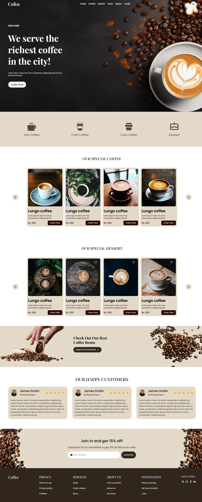

# ☕ Coffea - Premium Coffee & Desserts

A sleek, modern, and fully responsive landing page for a boutique coffee shop. **Coffea** showcases a curated selection of artisanal brews and decadent desserts, designed with a focus on high-quality visuals and smooth user experience.

---

##  Features

* **Fully Responsive:** Optimized for mobile, tablet, and desktop views using Tailwind's utility-first breakpoints.
* **Modern UI/UX:** Clean aesthetics with a warm, coffee-inspired color palette.
* **Interactive Components:** Smooth transitions and hover effects powered by React.
* **Sectioned Architecture:**
    * **Hero:** Catchy headline and call-to-action to grab attention.
    * **About:** The story and mission behind the bean.
    * **Coffee:** A catalog of signature roasts and brewing styles.
    * **Dessert:** A sweet menu featuring perfectly paired treats.
    * **Login:** A stylish interface for returning coffee enthusiasts.

---

##  Tech Stack

* **Frontend Library:** [React.js](https://reactjs.org/)
* **Styling:** [Tailwind CSS](https://tailwindcss.com/)
* **Icons:** [React Icons](https://lucide.dev/) (or FontAwesome/React Icons)

## Screenshot

;