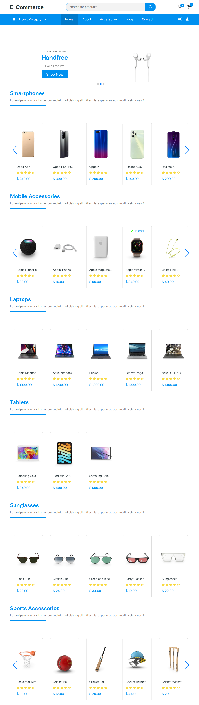

# 🛒 E-Commerce React App

A modern **E-Commerce web application** built using **React.js**.  
The application allows users to browse products from multiple categories, add products to favorites, manage a shopping cart, and navigate smoothly between pages.

The project uses the **DummyJSON API** to fetch real product data and demonstrates practical usage of React concepts such as **Context API, Hooks, and Client-Side Routing**.

---

## 🚀 Features

- Browse products from multiple categories
- View detailed product information
- Add products to **Favorites**
- Add products to **Cart**
- Increase or decrease product quantity in the cart
- Remove items from the cart
- Persistent cart and favorites using **LocalStorage**
- Dynamic product fetching from API
- Responsive design

---

## 🛠️ Built With

- **React.js**
- **React Router DOM**
- **React Icons**
- **Context API**
- **useState Hook**
- **useEffect Hook**
- **DummyJSON API**
- **CSS / Modern Layout**

---

## 📦 API Used

This project uses the public API:

https://dummyjson.com

Example endpoint:

## ScreenShot

