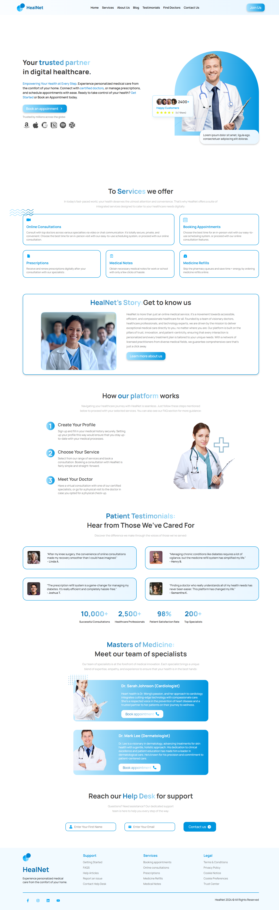

# 🏥 HealNet - Medical Services Website

## 📌 About HealNet

**HealNet** is a modern and responsive medical services website designed to connect patients with healthcare providers بسهولة وسرعة.
The platform aims to provide a seamless user experience for browsing doctors, exploring services, and booking appointments.

---

## 🚀 Features

* 📱 Fully responsive design (Mobile / Tablet / Desktop)
* 🎨 Clean and modern UI/UX From Figma
* ⚡ Fast performance

---

## 🛠️ Technologies Used

* React JS
* CSS3 (Flexbox & Grid)
* React Icons (Icons)

## 💡 Key Sections

* 🏠 Home
* 👨‍⚕️ Find a Doctor
* 🩺 Services
* 📖 About Us
* 📞 Contact

---

## 🎯 Purpose

This project was built to practice front-end development and create a real-world medical UI that demonstrates:

* Responsive layout techniques
* Clean design principles
* Interactive user experience

## 📸 Screenshots

  
  

## ⭐ Support

If you like this project, feel free to give it a ⭐ on GitHub!

