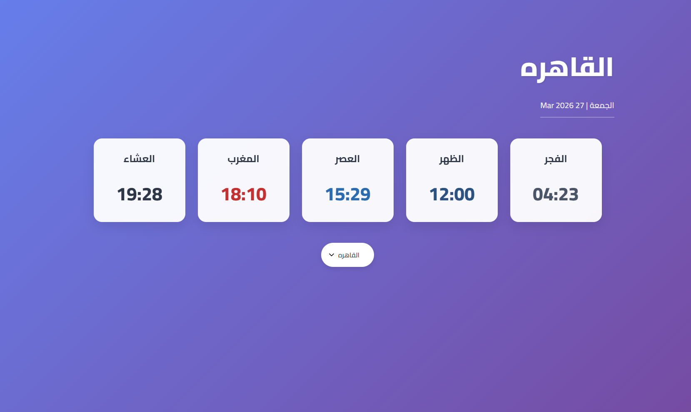

# Egyptian Prayer Times App 🕌

A responsive and stylish **Prayer Times** web application built with **React.js**. This app allows users to select a city in Egypt and view accurate prayer times using the [Aladhan API](https://aladhan.com/prayer-times-api).

---

## Features ✨

- Display **prayer times** for the selected city.
- Show **current date** in both Gregorian and Hijri formats.
- Fully **responsive design** for desktop and mobile.
- Smooth **loading animations** while fetching data.
- Clean and modern **UI/UX design**.

---

## Technologies Used 🛠️

- **React.js** – Frontend library for building UI.
- **JavaScript (ES6+)** – App logic and API integration.
- **Aladhan API** – Fetch prayer timings by city.
- **React Hooks** – State management with `useState` and `useEffect`.

---

## Screenshot

;

## Live Demo

<a href="https://egyptian-prayer-times-app.netlify.app/">live demo</a>