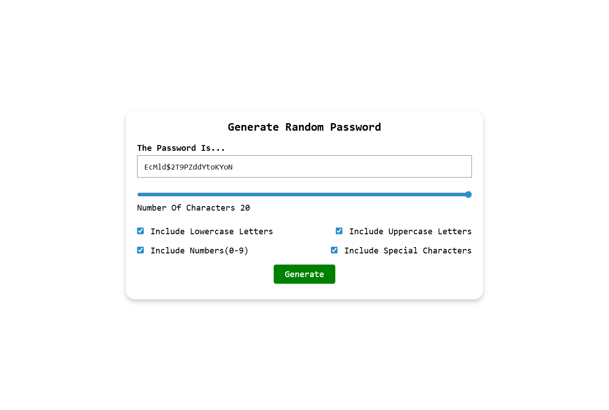

# Password Generator App

A simple React application that allows users to generate random passwords based on customizable criteria.  

---

## 🛠 Tools & Technologies

- **React** (Functional Components & Hooks)  
- **JavaScript**
- **HTML / CSS** 

---

## ⚡ Features

- Generate random passwords with customizable **length** (0–20 characters)  
- Include/exclude character types:  
  - Lowercase letters (`a–z`)  
  - Uppercase letters (`A–Z`)  
  - Numbers (`0–9`)  
  - Special characters (`!@#$&*()_`)  
- Real-time password display  
- Intuitive UI with checkboxes and range slider  

---

## 🎯 How It Works

1. User selects the **password length** using the slider.  
2. User chooses which **character types** to include via checkboxes.  
3. Click **Generate** to create a random password.  
4. The generated password is displayed in the result component.  

**Logic Highlights:**

- The password is generated using a **temporary variable** that combines selected character types.  
- `Math.random()` selects characters randomly from the combined string.  
- React's **state (`useState`)** is used only for values that affect the UI, like `password` and `inputs`.  

---

## 🖼 Screenshot

