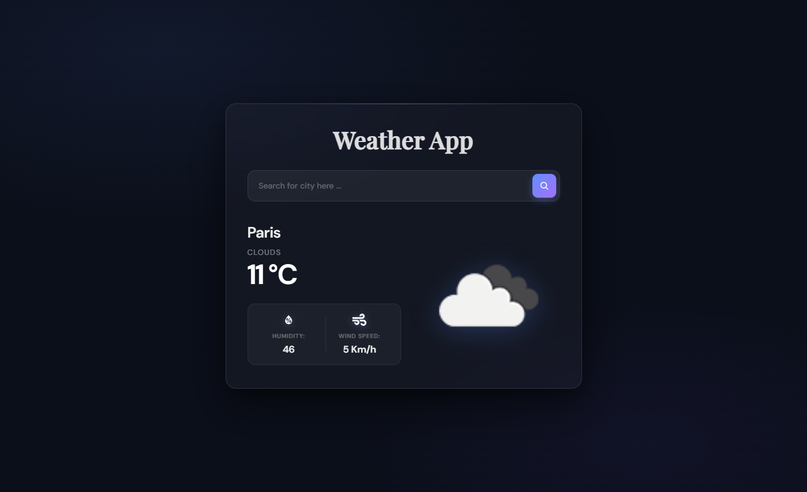

#  Weather App

A responsive and modern **React JS Weather App** that lets users search for any city and view real-time weather information with clean UI and animations.  

---

## 🔹 Features

- Search for any city to get current weather data.
- Displays:
  - Temperature (°C)
  - Weather condition (e.g., Clouds, Rain)
  - Humidity
  - Wind speed
  - Weather icon from OpenWeatherMap

---

## 🔹 Technologies Used

- **React JS** – Frontend framework
- **OpenWeatherMap API** – Weather data
- **CSS** – Styling and smooth UI
- Functional Components & React Hooks (`useState`)

---

## 🔹 Screenshot

;